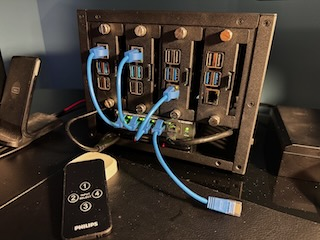

# lab-desc

The actual lab state is described here.



## Lab Equipment

After much trial and error, I found hardware I liked that is quiet, functional, reasonably priced, and out of the way in the office.

* Two to four Raspberry Pi 4s, 8GB
* [Amazon Basics 64GB MicroSD Cards (pack of 2)](https://www.amazon.com/Amazon-Basics-microSDXC-Memory-Adapter/dp/B08TJTB8XS/)
    * One pack for two Pis
* [TP-Link 5 Port POE+ Switch](https://www.amazon.com/gp/product/B0BWSWLV7L/)
* [Phillips 4 Port HDMI Switch](https://www.amazon.com/gp/product/B07BLLFF9N/)
* [6 Inch Patch Cables (pack of 10)](https://www.amazon.com/gp/product/B0B2ZN72B6/)
* [HDMI to (Angled) Micro HDMI Cables](https://www.amazon.com/gp/product/B07DVZJBFR/)
* [UCTronics Raspberry Pi 5/4/3B POE+ HAT](https://www.amazon.com/gp/product/B0D6QTG2XN/)
    * One for each Pi
* [UCTronics 4 Port Raspberry Pi Cluster Enclosure](https://www.amazon.com/gp/product/B09S11Q684/)
* [UCTronics SD Card Flexible Extender (pack of 4)](https://www.amazon.com/gp/product/B09CKRDFTH/)
* [Knurled Thumb Screws (OPTIONAL)](https://www.amazon.com/gp/product/B0CR1DR6N5/)
    * Got these because I was opening the case up a bunch

## Non-lab Equipment

You'll need to provide services to your lab.

### Network

You can keep this simple. I'm running Omada networking equipment around the house, and a TP-Link managed switch in my office. You won't need that level of sophistication; frankly, it turns out I wanted more.

### Services

My Synology DS920+ acts as my central server, with the following services installed:
* Synology Packages
    * DNS
        * forwarding resolution to Adguard
    * DHCP
        * MAC address reservations to Pi4s
    * gitea
        * keeping home git at home
* Container Manager
    * Adguard
        * regular home Adguard duties
        * lab and central service DNS rewrites
    * Promtail/Loki/Grafana
        * syslog catch all

#### gitea on Synology

Add the following to `/var/packages/gitea/var/conf.ini`
```
[server]
START_SSH_SERVER = true
SSH_PORT = 2222
```

## Considerations

Some lessons were learned.

### Lab Systems

Originally starting with Pi 5s, I finally downgraded to Pi 4s because UEFI for the Pi 5 isn't in the required state to provide support, and development speed is extremely lacking. Rasbperry Pi 4s are, unfortunately, the only proven single board computers that can run Flatcar. 

### Network

I wanted to properly segment the lab away from the rest of the network, but Omada and Synology have limitations.
Omada can handle 802.1q VLANs well. It can handle DHCP reservation records, but, frustratingly, not hostname reservations within those records.
Synology DHCP can handle DHCP hostname reservations. Synology itself can handle VLAN 802.1q tagging, but only as an end device. Openvswitch is natively available, but their version of openvswitch is from 2021, which doesn't support the necessary flags to provide DHCP over tagged VLANs.
Hosting openvswitch and DHCP on the lab equipment are likely possible; however, that's poor lab design, so the idea was scrapped. Ultimately, I've been forced to flatten the network to a zero VLAN setup.